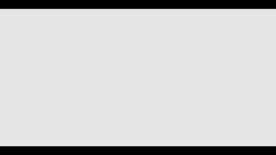

<h1>Kahve Dükkanı Sayfası Proje</h1>
Bu proje, HTML ve CSS ile tasarlanarak yapılmıştır. Sayfa, Starbucks'ın temel görsellerini ve stilini içerir.

<h2>Özellikler</h2>
<ul>
  <li>HTML: Sayfa yapısını oluşturmak için kullanılmıştır.</li>
<li>CSS: Sayfa stilini oluşturmak için kullanılmıştır.</li>
  </ul>
<h4>Kullanım</h4>
Projeyi bilgisayarınıza klonladıktan sonra, index.html dosyasını herhangi bir tarayıcıda açarak projenin nasıl göründüğünü inceleyebilirsiniz.

